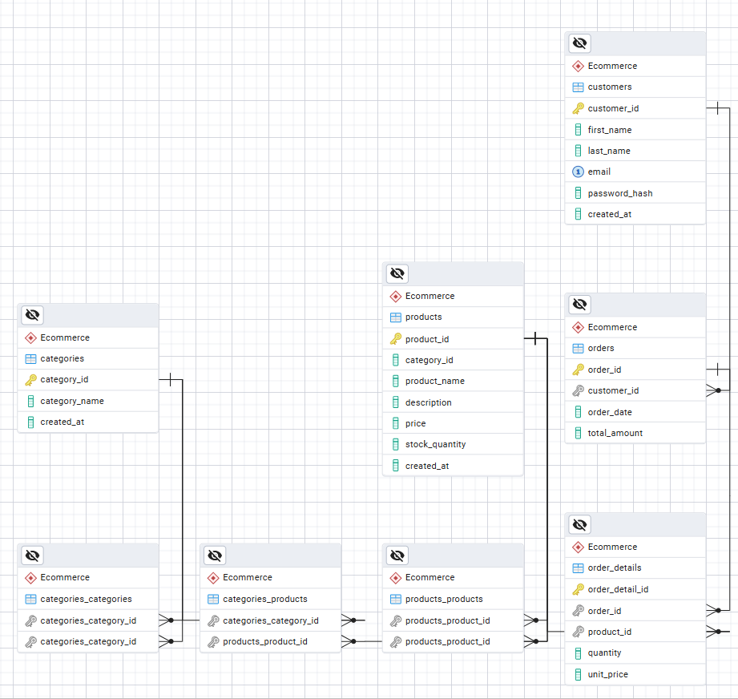

# Ecommerce-Database

Create the DB schema script with the following entities

- Identify the relationships between entities
- Draw the ERD diagram of this sample schema
  g p
- Write an SQL query to generate a daily report of the total revenue for a specific date.
- Write an SQL query to generate a monthly report of the top-selling products in a given month.
- Write a SQL query to retrieve a list of customers who have placed orders

## Script:

```
CREATE SCHEMA ecommerce;

CREATE TABLE categories (
    category_id SERIAL PRIMARY KEY,
    category_name VARCHAR(30) NOT NULL,
    created_at TIMESTAMP DEFAULT NOW()
);

CREATE TABLE products (
    product_id SERIAL PRIMARY KEY,
    category_id INT REFERENCES ecommerce.categories(category_id),
    product_name VARCHAR(50) NOT NULL,
    description VARCHAR(255),
    price NUMERIC(10,2) NOT NULL,
    stock_quantity INT NOT NULL,
    created_at TIMESTAMP DEFAULT now()
);

CREATE TABLE customers (
    customer_id SERIAL PRIMARY KEY,
    first_name VARCHAR(50) NOT NULL,
    last_name VARCHAR(50),
    email VARCHAR(150) UNIQUE NOT NULL,
    password_hash TEXT NOT NULL,
    created_at TIMESTAMP DEFAULT NOW()
);

CREATE TABLE orders (
    order_id SERIAL PRIMARY KEY,
    customer_id INT NOT NULL REFERENCES ecommerce.customers(customer_id),
    order_date DATE NOT NULL DEFAULT CURRENT_DATE,
    total_amount NUMERIC(10,2) NOT NULL
);

CREATE TABLE order_details (
    order_detail_id SERIAL PRIMARY KEY,
    order_id INT REFERENCES ecommerce.orders(order_id),
    product_id INT REFERENCES ecommerce.products(product_id),
    quantity INT NOT NULL,
    unit_price NUMERIC(10,2) NOT NULL
);

```

## ERD Schema



## The Relation between Entities:

- M:m products and orders
- M:m products and categories
- 1:m customers and orders

## A SQL query to generate a daily report of the total revenue for a specific date

```sql
select Sum(total_amount) AS today_sum GROUP BY order_date where order_date="2025-month-day" from "Ecommerce".orders;
```

## A SQL query to generate a monthly report of the top-selling products in a given month

```sql
Select products.product_id, products.product_name, Sum(order_details.quantity * order_details.unit_price) As top_selling_product
from order_details
join order_details.product_id on order_details.product_id = products.product_id
join orders on orders.order_id = order_details.order_id
where orders.order_date between  "2025-month-day" AND "2025-month-day"
Group By products.product_id, products.product_name
ORDER BY top_selling_product DESC
Limit 5;
```

## A SQL query to retrieve a list of customers who have placed orders totaling more than $500 in the past month.

Include customer names and their total order amounts

```sql
select Contact(first_name, last_name) AS full_name, Sum(total_amount)
from "Ecommerce".customers
JOIN "Ecommerce".orders ON orders.customer_id = customers.customer_id
Group by customers.customer_id
WHERE orders.order_date >= CURRENT_DATE - INTERVAL '1 month'
    AND orders.order_date < CURRENT_DATE
HAVING Sum(total_amount) > 500;
limit 5;
```

## Could we apply denormalization ?.

yes, we can by adding product name at order_details table

## Write a SQL query to search for all products with the word "camera" in either the product name or description.

```sql
select * from products where product_name LIKE '%camera%' or description LIKE '%camera%';
```

##

```sql
INSERT INTO "Ecommerce".sale_history_log(customer_id,
operation,order_id,product_id,total_amount,order_date)
values (
NEW.customer_id,
"insert",
NEW.order_id,
od.product_id,
New.total_amount,
NEW.order_date
);
RETURN NEW;
end;
$$ LANGUAGE plpgsql;


create or replace trigger sale_history_trigger
after insert on "Ecommerce".orders
for each row
execute function "Ecommerce".create_sale_history();
```

## Lock quantity

``sql
BEGIN

select quantity from products where product_id=22 for update

END
``

## LOCK the row

``sql
BEGIN

select \* from products where product_id=22 for update

END
``

## The Optimization Task

| #   | Query                                                                                                                                                                                                                                              | Execution Time (Before Optimization) | Optimization Technique                                                                                                                                     | Query Rewrite | Execution Time (After Optimization) |
| --- | -------------------------------------------------------------------------------------------------------------------------------------------------------------------------------------------------------------------------------------------------- | ------------------------------------ | ---------------------------------------------------------------------------------------------------------------------------------------------------------- | ------------- | ----------------------------------- |
| 5   | `SELECT category_id, COUNT(product_id) FROM products GROUP BY category_id;`                                                                                                                                                                        | 1080 ms                              | `CREATE INDEX idx_category_count ON products(product_id, category_id);`                                                                                    | Same          | 815 ms                              |
| 6   | `SELECT c.first_name, c.last_name, c.customer_id, SUM(orders.total_amount) AS total_spent FROM customers c JOIN orders ON c.customer_id = orders.customer_id GROUP BY c.customer_id, c.first_name, c.last_name ORDER BY total_spent DESC LIMIT 5;` | 10626.086 ms                         | `CREATE INDEX idx_orders_customer_id ON orders(customer_id, order_id);`<br>`CREATE INDEX idx_first_last ON customers(customer_id, first_name, last_name);` | Same          | 9399 ms                             |
| 7   | `SELECT c.first_name, c.last_name, o.order_id, o.order_date FROM orders o JOIN customers c ON c.customer_id = o.customer_id ORDER BY o.order_date DESC LIMIT 1000;`                                                                                | 2509.168 ms                          | `CREATE INDEX idx_order_date ON orders(order_date);`                                                                                                       | Same          | 1.876 ms                            |
| 8   | `EXPLAIN ANALYZE SELECT * FROM products p WHERE p.stock_quantity < 10;`                                                                                                                                                                            | 35 ms                                | Partial Index<br>`CREATE INDEX idx_stock_quantity ON products(stock_quantity) WHERE stock_quantity < 10;`                                                  | Same          | 21.396 ms                           |
| 9   | `EXPLAIN ANALYZE SELECT p.product_name, p.category_id, SUM(od.unit_price * od.quantity) AS category_revenue FROM order_details od JOIN products p ON p.product_id = od.product_id GROUP BY p.category_id, p.product_name;`                         | 51256.590 ms                         | Expression Index<br>`CREATE INDEX idx_od_pr_product_id ON order_details((quantity * unit_price) DESC) INCLUDE (product_id);`                               | Same          | 24746.183 ms                        |
